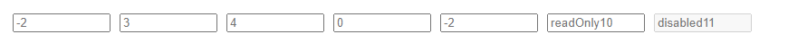

# react-tabindex-content

you can use tab to switch the focus of dom elements

# Example



the following order of focus is  3->4->0 , if the allowReadOnly is true , the order will be 3->4->10->0

# Installation

```
npm install react-tabindex-content
#or
yarn add react-tabindex-content
```

# API

| Property | Description | Type | Default |
| --- | --- | --- | --- |
| global | effective range , global or inside div | bool | true |
| allowReadOnly | allow readonly element to focus | bool | false |

# How to use it

```js
import React from "react";
import ReactDOM from "react-dom";
import TabIndexContent from "react-tabindex-content";

function App(props) {
    return (
        <div>
            <TabIndexContent global={true} allowReadOnly={true}>
                {
                    new Array(5).fill().map((item, index) => {
                        let tabIndex = Math.floor(Math.random() * 10 + (-5));
                        return (
                            <input key={index} style={{ width: 100, marginLeft: 10, marginTop: 10 }} tabIndex={tabIndex} placeholder={tabIndex}></input>
                        )
                    })
                }
                <input style={{ width: 100, marginLeft: 10, marginTop: 10 }} tabIndex={10} readOnly placeholder={`readOnly${10}`}></input>
                <input style={{ width: 100, marginLeft: 10, marginTop: 10 }} tabIndex={11} disabled placeholder={`disabled${11}`}></input>
            </TabIndexContent>
        </div>
    );
}

ReactDOM.render(<App />, document.getElementById("app"));
```
